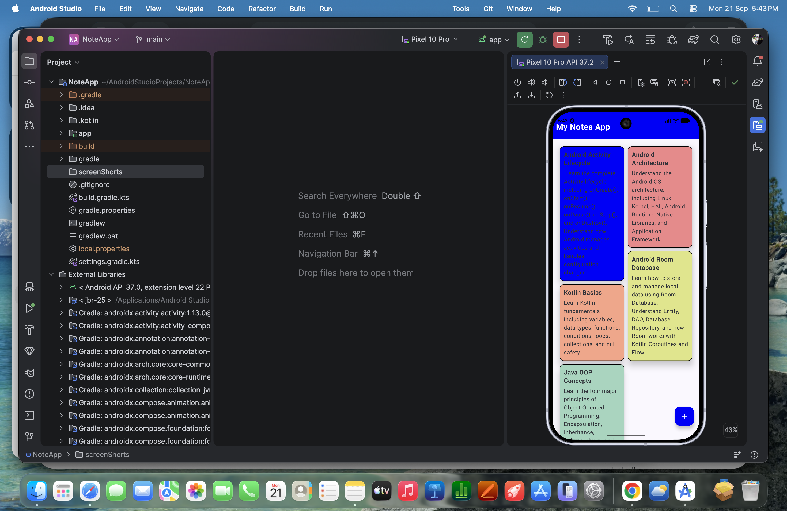

# 📝 Notes App

A modern and simple **Notes App** built using **Kotlin and Jetpack Compose**, following the **MVVM (Model–View–ViewModel) architecture**. The app uses **Room Database** for local data storage, allowing users to create, update, delete, and manage notes efficiently.

## 📱 App Screenshots

<p align="center">
    

</p>

## 🚀 Features

* ✏️ Create new notes
* 📝 Edit existing notes
* 🗑️ Delete notes
* 🎨 Choose different note colors
* 💾 Store notes locally using Room Database
* 🔄 Reactive UI updates
* 📱 Modern Jetpack Compose UI
* 🏗️ MVVM architecture
* ⚡ Kotlin Coroutines for asynchronous operations
* 🔁 StateFlow for observing data changes

## 🛠️ Tech Stack

* **Kotlin**
* **Jetpack Compose**
* **MVVM Architecture**
* **Room Database**
* **Kotlin Coroutines**
* **StateFlow**
* **Material 3**

## 🏗️ Architecture

The application follows the **MVVM architecture**:

```text
UI / Jetpack Compose
        ↓
   ViewModel
        ↓
   Repository
        ↓
   Room Database
        ↓
       DAO
```

### View

The UI is built using **Jetpack Compose**. It observes the state exposed by the ViewModel and displays the notes.

### ViewModel

The `ViewModel` manages UI state and handles user actions such as creating, updating, and deleting notes.

### Repository

The Repository acts as a single source of truth and provides a clean layer between the ViewModel and Room Database.

### Room Database

Room provides local persistent storage for notes.

```text
Note Entity
     ↓
    DAO
     ↓
Room Database
     ↓
Repository
     ↓
ViewModel
     ↓
Jetpack Compose UI
```

## 📂 Project Structure

```text
com.example.noteapp
│
├── data
│   ├── local
│   │   ├── NoteDao.kt
│   │   ├── NoteDatabase.kt
│   │   └── NoteEntity.kt
│   │
│   └── repository
│       └── NoteRepository.kt
│
├── view
│   ├── HomeScreen.kt
│   ├── AddNoteScreen.kt
│   └── ColorPicker.kt
│
├── viewmodel
│   └── NoteViewModel.kt
│
└── MainActivity.kt
```

## 💾 Local Database

The app uses **Room Database** to store notes locally.

Each note contains information such as:

```text
Note
├── id
├── title
├── description
└── color
```

Room allows the notes to remain available even after the application is closed and reopened.

## ⚡ Reactive Data Flow

The application uses **Coroutines and Flow/StateFlow** to handle asynchronous database operations and update the UI reactively.

```text
User Action
     ↓
Compose UI
     ↓
ViewModel
     ↓
Repository
     ↓
Room
     ↓
Flow / StateFlow
     ↓
Compose UI Update
```

## 🎯 Goal

The main goal of this project is to demonstrate how to build a modern Android application using:

**Kotlin + Jetpack Compose + MVVM + Repository Pattern + Room Database + Coroutines + StateFlow**

This project is also useful for understanding clean separation of UI, business logic, and data persistence in Android development.

## 👩‍💻 Author

**Nisha Kumari**

Android Developer | Kotlin | Jetpack Compose
